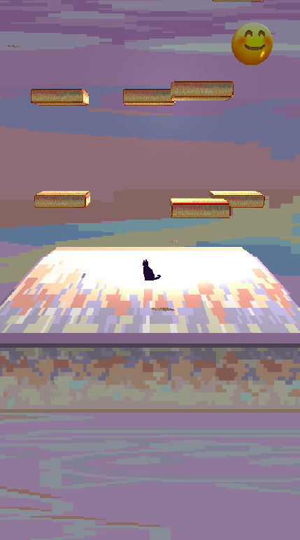

# Cat Jump 3D #

Juego de plataformas 3D en Python usando OpenGL.




## Preámbulo ##

Un gatito observa en lo más alto de la torre de rascaderos una bola de lana con la cuál jugar,
pero mientras escala, la mascota del hogar (un travieso perro) se da cuenta y quiere meter sus
narices donde no debe.

Deberás nuevamente ayudar al gato a conseguir la bola de lana mientras evitas que caiga a la
base. En altura estará tranquilo fuera del alcance de ciertas patitas felpudas. Sin embargo, esta vez
será más difícil.

El escenario se ha vuelto más complejo y muchas estructuras se han desgastado por lo mucho
que el gato jugó durante el proyecto anterior. Si vas a guiarlo por estas, debes hacerlo con cuidado
pues se desprenden tras un momento de ser pisadas.
Además, estamos en una complicada transición de primavera a verano de un año muy caótico
y, en particular, plagado de polillas.
Estos animalitos no son dañinos, pero han llamado la atención de los humanos sirvientes del
gato, quienes se han juntado a observar la aventura, expectantes a que ocurra algún tipo de cacerío.

La verdad es que nuestro amigo gatuno en su comodidad ha olvidado cómo lidiar con insectos.
Por alguna razón que desconoce, los humanos se decepcionan cuando los deja en paz.
Sus sirvientes toleran que el gato deje a lo más a dos polillas con las cuales se topa seguir
volando. Repetir esto más veces hará que se impacienten y les de el impulso de tomar al gato y
bajarlo de la estructura.

En lo posible, evita que el gato se tope con polillas, así nadie se decepciona y la aventura puede
continuar ininterrumpida.

## Instrucciones de Ejecución ##

### Llamado en Consola ###

Abrir la carpeta ```codigo``` donde se encuentra el script. El comando para iniciar el juego es:

    python cat_jump.py [structure.csv]

Donde ```[structure.csv]``` es un parámetro opcional con la ruta de un archivo csv que personaliza
la estructura del nivel. 

El archivo debe consistir de cinco columnas y un número arbitrario de filas
de ceros, unos o x, donde 1 indica la presencia de una plataforma, 0 que no está presente y x que es 
una plataforma falsa (se desprende después de un tiempo de caer sobre ella). 

Las plataformas en las columnas pares están en un plano más al frente que aquellas de las columnas impares.

Evitar colocar una fila de
solo ceros pues esto impide el avance por el nivel.

Si no se especifica este parámetro, se usa el archivo en ```codigo/ex_structure.csv```.

### Controles ###

Para desplazarse hacia el frente del gato, se mantiene presionada la tecla **W** para ganar velocidad y se suelta para 
detenerse. Para girar a la izquierda del gato se mantiene presionada la tecla **A** y para girar a su derecha, se usa 
la tecla **D**.

Los saltos se realizan presionando la **barra espaciadora** una vez, no existen saltos múltiples en el aire.


Adicionalmente, la vista de la escena se puede cambiar con los siguientes controles:
* `Tecla B` - vista frontal, tercera persona.
* `Tecla N` - vista aérea, tercera persona.
* `Tecla M` - vista en primera persona.


### Requerimientos ###

Python 3 o superior.

Todas las librerías en ``codigo`` son requeridas. Adicionalmente el programa usa `numpy`, `matplotlib`, `glfw` y `pyopengl`.

## Créditos ##
Realizado como tarea para el curso Modelación y Computación Gráfica para Ingenieros (CC3501) de la Universidad de Chile,
del semestre de primavera 2020.

Muchas de las librerías de apoyo parte del cuerpo docente, como ``easy_shaders.py`` o `basic_shapes.py` 
que son de Daniel Calderón, o `basic_shapes_extended.py` y `camera.py` que son de [Pablo Pizarro](https://home.ppizarror.com/).

### Autor ###

Valentina Garrido, 2020.